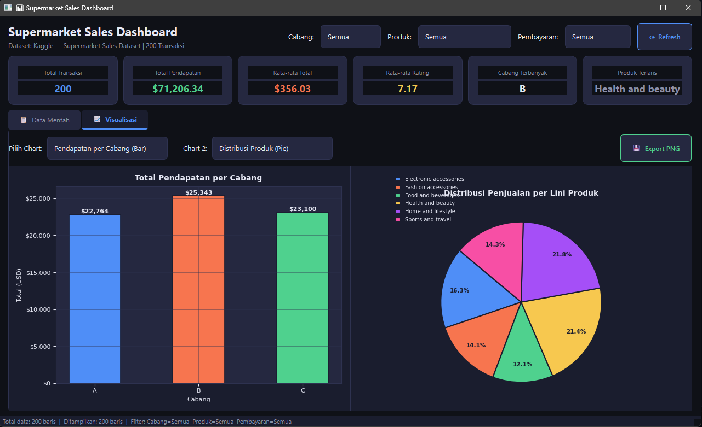
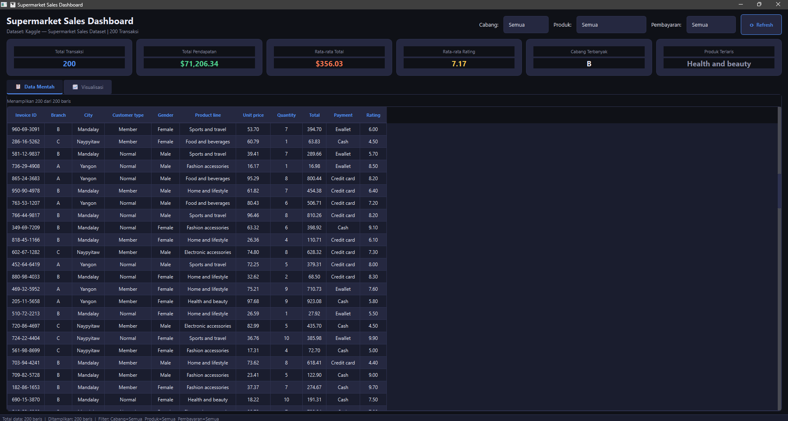

# Tugas 6 — Visualisasi Data: Supermarket Sales Dashboard

> **Nama  :** [Lalu Rifqi Ramadhan]  
> **NIM   :** [F1D02310071]  
> **Kelas :** [Pemrograman Visual D]

---

## Deskripsi Singkat

Aplikasi **dashboard interaktif** berbasis **PySide6** yang memvisualisasikan data transaksi penjualan supermarket. Chart di-render langsung di dalam aplikasi menggunakan **Matplotlib** yang tertanam (embedded) di widget PySide6 — bukan jendela Matplotlib terpisah.

---

## Dataset

**Sumber:** [Supermarket Sales Dataset — Kaggle](https://www.kaggle.com/datasets/faresashraf1001/supermarket-sales)  
**Jumlah data:** 200 baris transaksi (Jan–Mar 2019)

### Kolom Utama

| Kolom | Deskripsi |
|---|---|
| `Invoice ID` | ID unik setiap transaksi |
| `Branch` | Cabang toko (A = Yangon, B = Mandalay, C = Naypyitaw) |
| `City` | Kota lokasi cabang |
| `Customer type` | Jenis pelanggan: Member / Normal |
| `Gender` | Jenis kelamin pembeli: Male / Female |
| `Product line` | Kategori produk (Health & Beauty, Electronics, dll.) |
| `Unit price` | Harga satuan produk (USD) |
| `Quantity` | Jumlah unit yang dibeli |
| `Tax 5%` | Pajak 5% dari subtotal |
| `Total` | Total pembayaran termasuk pajak |
| `Date` | Tanggal transaksi |
| `Time` | Jam transaksi |
| `Payment` | Metode pembayaran: Ewallet / Cash / Credit card |
| `cogs` | Cost of Goods Sold (biaya pokok penjualan) |
| `gross income` | Keuntungan kotor per transaksi |
| `Rating` | Rating kepuasan pelanggan (1–10) |

---

## Fitur yang Diimplementasikan

| No | Fitur | Status |
|---|---|---|
| 1 | Data minimal 50 baris dari dataset nyata (Kaggle) | ✅ 200 baris |
| 2 | Tampilan data mentah di `QTableWidget` | ✅ |
| 3 | Minimal dua jenis chart Matplotlib | ✅ 6 jenis chart |
| 4 | Filter kategori interaktif | ✅ 3 filter (Cabang, Produk, Pembayaran) |
| 5 | Tombol Refresh | ✅ |
| 6 | Export chart ke PNG | ✅ |
| 7 | Kartu ringkasan statistik | ✅ |
| 8 | Dataset Kaggle dijelaskan | ✅ (Bonus) |

### Jenis Chart yang Tersedia
1. **Bar Chart** — Total Pendapatan per Cabang
2. **Line Chart** — Tren Pendapatan Harian
3. **Scatter Chart** — Hubungan Rating vs Total Pembelian (+ garis tren)
4. **Grouped Bar Chart** — Pendapatan per Cabang & Gender
5. **Pie Chart** — Distribusi Penjualan per Lini Produk
6. **Horizontal Bar Chart** — Total per Metode Pembayaran

---

## Struktur Project

```
dashboard_project/
├── main.py            # Entry point — jalankan file ini
├── main_window.py     # Jendela utama & layout dashboard
├── chart_widget.py    # Widget Matplotlib (semua fungsi chart)
├── data_loader.py     # Pemuat & pemroses data
├── README.md          # Dokumentasi ini
└── screenshots/
    ├── foto1.png
    └── foto2.png
```

---

## Cara Menjalankan

### 1. Install Dependensi

```bash
pip install PySide6 pandas matplotlib numpy
```

### 2. Jalankan Aplikasi

```bash
python main.py
```

### 3. (Opsional) Gunakan Dataset Kaggle Asli

Unduh file CSV dari [Kaggle](https://www.kaggle.com/datasets/faresashraf1001/supermarket-sales), lalu ubah pemanggilan di `main_window.py`:

```python
self.df_all = load_data("path/ke/supermarket_sales.csv")
```

---

## Screenshots

### Dashboard Utama (Tab Visualisasi)



### Tab Data Mentah




